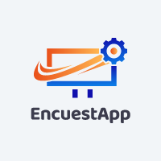

# EncuestApp
EncuestApp es una plataforma versátil que permite a los usuarios crear y responder encuestas de manera fácil y eficiente. Los usuarios pueden crear encuestas personalizadas y compartir fácilmente el enlace con su audiencia, mientras que los administradores tienen control total sobre la gestión de las encuestas.

# Características
- Crear Encuestas: Los usuarios pueden crear encuestas personalizadas con diferentes tipos de preguntas, incluyendo opción múltiple, selección única, respuestas cortas, y más.
- Responder Encuestas: Los usuarios pueden responder encuestas de forma rápida y sencilla a través de un enlace compartido.
- Gestión de Encuestas: Los administradores tienen acceso a herramientas de gestión que les permiten editar, borrar, deshabilitar y ver estadísticas de las encuestas.
- Interfaz Intuitiva: La interfaz de usuario es intuitiva y fácil de usar, lo que permite a los usuarios crear y responder encuestas sin complicaciones.

# Test

- https://encuestapp.netlify.app/

# Tecnologias y librerias utilizadas
 

 
 
 
 

  
# Contribución
- Las contribuciones son bienvenidas! Si quieres mejorar este proyecto, siéntete libre de abrir un problema o enviar una solicitud de extracción.

# Creadores

- Mauricio Torres
- Abel Reynoso
- Daniel Cabral
- Nicolas Paz
